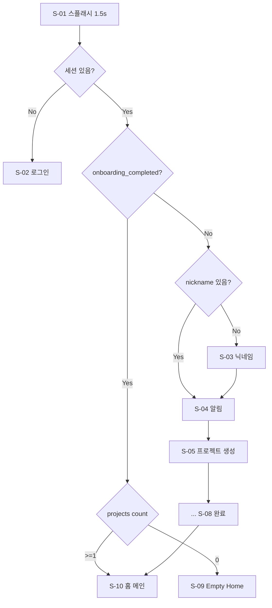
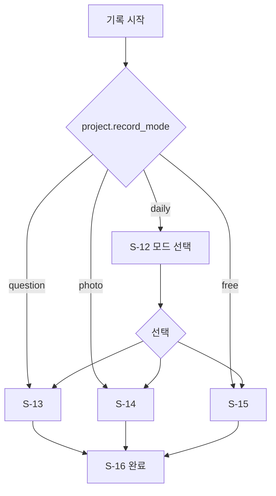

# MyChapter — 라우팅 & 사용자 플로우

## 1. 전체 라우트 맵

```
공개
  /splash                         S-01
  /login                          S-02
  /login/email                    S-02e  이메일 Magic Link

온보딩 (auth, onboarding_completed = false)
  /onboarding/nickname            S-03
  /onboarding/notification        S-04

프로젝트 생성 (auth)
  /project/new                    S-05
  /project/new/setup              S-06
  /project/new/mode               S-07
  /project/new/complete           S-08

메인 탭 (auth, AppLayout + TabBar)
  /home                           S-09 | S-10 (조건부)
  /records                        S-30
  /book                           S-17 | Empty
  /mypage                         S-23

홈·알림
  /notifications                  S-11
  /projects                       S-10b  (Pro only, projects > 1)

기록 플로우
  /record/mode                    S-12
  /record/write/question          S-13
  /record/write/photo             S-14
  /record/write/free              S-15
  /record/complete                S-16

기록 CRUD
  /records/:id                    S-31
  /records/:id/edit               S-13|14|15 (prefill)

책 플로우
  /book/chapter/:id               S-18
  /book/chapter/:id/edit          S-19
  /book/cover                     S-20
  /book/publish/complete          S-21

마이·설정·법적
  /mypage/settings                S-24
  /mypage/notification-settings   S-24 내 섹션 (또는 동일 화면 앵커)
  /mypage/subscription            S-24 내 섹션
  /mypage/completed-books         S-24 또는 별도 리스트
  /mypage/delete-account          S-W1
  /mypage/privacy-policy          S-W2  → WebView 외부 URL
  /mypage/terms-of-service        S-W3  → WebView 외부 URL

오버레이 (라우트 없음, Modal/BottomSheet)
  S-P1  Pro 업그레이드
  S-32  기록 수정/삭제 바텀시트 (S-31 위)
```

---

## 2. Auth Guard 분기



### 스플래시 SPEC 수정안

| 조건 | 다음 화면 |
|------|-----------|
| 비로그인 | S-02 |
| 로그인 + onboarding 미완료 | S-03 또는 S-04 |
| 로그인 + onboarding 완료 + projects 0 | **S-09** |
| 로그인 + onboarding 완료 + projects >= 1 | S-10 |

---

## 3. 기록 작성 진입



**진입점:**

- S-10 "지금 답하기" → question 모드 또는 S-12
- S-30 "+ 기록" → S-12 또는 고정 모드 직행
- S-08 "지금 첫 기록" → S-13 (첫 질문 이미 생성됨)
- 푸시 알림 딥링크 → `/record/mode`

---

## 4. 오늘의 질문 캐싱

1. 홈(S-10) 진입 시 `daily_questions`에서 `project_id + question_date = today` 조회
2. 없으면 `generate-question` 호출 후 INSERT
3. **하루 1질문** — 자정(Asia/Seoul) 이후 새 질문
4. Free: 호출 전 `ai_usage` 월 10회 체크

---

## 5. S-09 Empty State variants

| 탭 | 조건 | 제목 | CTA |
|----|------|------|-----|
| 홈 | projects = 0 | 아직 프로젝트가 없어요 | 첫 프로젝트 시작하기 → S-05 |
| 기록 | records = 0 | 아직 기록이 없어요 | 첫 기록 쓰기 → 기록 플로우 |
| 내 책 | chapters 완성 0 & 진행 0 | 완성한 책이 아직 없어요 | 홈으로 → /home |

컴포넌트: `<EmptyState variant="home|records|book" />`

---

## 6. S-10 "전체보기"

| 조건 | 동작 |
|------|------|
| Free (프로젝트 1개) | **링크 숨김** |
| Pro + 프로젝트 2개 이상 | `/projects` (S-10b) 이동 |

---

## 7. S-24 설정 화면 구조

```
┌─────────────────────────────┐
│ ←  설정                     │
├─────────────────────────────┤
│ 알림                        │
│  기록 알림          [ON]    │
│  알림 시간          21:00 ▾  │
├─────────────────────────────┤
│ 계정                        │
│  닉네임 변경          지현 ›  │
│  프로필 이모지        🌿 ›   │
├─────────────────────────────┤
│ 구독                        │
│  현재 플랜            Free ›  │
│  (Pro 시: 구독 관리)        │
├─────────────────────────────┤
│ 앱 정보                     │
│  이용약관                 ›  │ → S-W3
│  개인정보처리방침         ›  │ → S-W2
│  버전                 1.0.0 │
├─────────────────────────────┤
│  로그아웃                   │
│  계정 삭제            (빨강) │ → S-W1
└─────────────────────────────┘
```

마이페이지(S-23) ⚙ 탭 → `/mypage/settings`

---

## 8. S-02e 이메일 Magic Link

```
┌─────────────────────────────┐
│ ←  이메일로 시작하기         │
├─────────────────────────────┤
│ 이메일 주소                 │
│ [___________________]       │
│                             │
│ [로그인 링크 보내기]         │
└─────────────────────────────┘

발송 후:
│ ✉️ 메일을 확인해주세요       │
│ example@email.com 으로      │
│ 로그인 링크를 보냈어요       │
```

`supabase.auth.signInWithOtp({ email })`

---

## 9. S-W2 / S-W3

동일 레이아웃. NavBar 제목과 WebView URL만 다름.

| 화면 | 제목 | URL |
|------|------|-----|
| S-W2 | 개인정보처리방침 | `VITE_PRIVACY_POLICY_URL` |
| S-W3 | 이용약관 | `VITE_TERMS_URL` |

MVP: `public/legal/privacy.html`, `public/legal/terms.html` 정적 페이지 배포.
