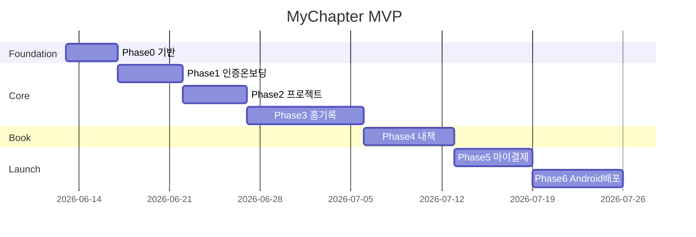

# MyChapter — 개발 구현 계획

> 설계 문서: `docs/00` ~ `docs/04` 기준  
> 예상 기간: **1인 풀타임 약 6주** (MVP + Play 내부테스트)

---

## 마일스톤 개요



---

## Phase 0 — 프로젝트 기반 (4일)

### Day 1: 스캐폴딩

- [ ] `npm create vite@latest . -- --template react-ts`
- [ ] Tailwind, path alias, ESLint
- [ ] 패키지 설치:
  ```
  @supabase/supabase-js zustand react-router-dom
  @capacitor/core @capacitor/cli @capacitor/android
  @capacitor/push-notifications @capacitor/camera @capacitor/share
  ```
- [ ] `capacitor.config.ts` — `appId: com.mychapter.app`
- [ ] 디자인 토큰 (`tailwind.config`) — 와이어프레임 CSS 변수 반영
- [ ] Noto Sans KR / Noto Serif KR

### Day 2: 라우팅 & 레이아웃

- [ ] `src/router/index.tsx` — `docs/01-routing-and-flows.md` 전체 라우트
- [ ] `AppLayout` + `TabBar` (홈/기록/내책/마이)
- [ ] `AuthGuard`, `OnboardingGuard`
- [ ] 모든 페이지 placeholder

### Day 3: 공통 컴포넌트

- [ ] Button, Card, Input, Textarea, Chip, ProgressBar, Badge
- [ ] BottomSheet, Modal, EmptyState (variant: home/records/book)
- [ ] NavBar, TabBar

### Day 4: Supabase & DB

- [ ] `src/lib/supabase.ts`
- [ ] `supabase/migrations/001_initial_schema.sql`
- [ ] `002_rls_policies.sql`
- [ ] `003_triggers.sql`
- [ ] `004_seed_data.sql` (선택)
- [ ] TypeScript 타입 생성

**완료 기준:** `npm run dev` + 빈 라우트 전환 + Supabase 로컬/원격 연결

---

## Phase 1 — 인증·온보딩 (5일)

| 일차 | 작업 | 화면 |
|------|------|------|
| 1 | Supabase Auth Kakao/Google OAuth 설정 | S-02 |
| 2 | Magic Link 이메일 | S-02e |
| 3 | 스플래시 분기 로직 | S-01 |
| 4 | 닉네임·알림 권한 | S-03, S-04 |
| 5 | onboarding_completed 플래그, 약관 링크 | S-W2, S-W3 WebView |

**스토어:** `authStore.ts` — session, user, profile

**완료 기준:** 신규 유저 S-01→S-05, 기존 유저 S-10/S-09 분기

---

## Phase 2 — 프로젝트 생성 (5일)

| 일차 | 작업 | 화면 |
|------|------|------|
| 1 | 프로젝트 유형 constants | S-05 |
| 2 | AI 루틴 계산 + 실시간 UI | S-06 |
| 3 | 기록 모드 선택 + DB INSERT | S-07 |
| 4 | `generate-question` Edge Function | S-08 |
| 5 | Free 프로젝트 1개 제한 + S-P1 | — |

**스토어:** `projectStore.ts`  
**유틸:** `calculateRoutine()` — `docs/04-business-rules.md`

**완료 기준:** 프로젝트 생성 → 첫 AI 질문 표시 → 홈 진입

---

## Phase 3 — 홈·기록 (9일) ★ 핵심

| 일차 | 작업 | 화면 |
|------|------|------|
| 1 | Empty State 3 variant | S-09 |
| 2 | 홈 메인 (진행률, streak, 질문) | S-10 |
| 3 | 알림 목록 | S-11 |
| 4 | 모드 선택 | S-12 |
| 5 | 질문 모드 + draft | S-13 |
| 6 | 사진 모드 + Storage | S-14 |
| 7 | 자유 일기 + hint API | S-15 |
| 8 | 저장 완료 + 배지 | S-16 |
| 9 | 기록 목록/상세/바텀시트 | S-30~32 |

**병행:**

- [ ] `generate-freewriting-hint` Edge Function
- [ ] `on-record-saved` 스트릭·배지 로직
- [ ] 기록 목록 infinite scroll (20개)

**스토어:** `recordStore.ts`

**완료 기준:** 3모드 기록 CRUD + 홈 진행률 실시간 반영

---

## Phase 4 — 내 책 (7일)

| 일차 | 작업 | 화면 |
|------|------|------|
| 1 | 챕터 리스트 + 진행 중 챕터 | S-17 |
| 2 | `generate-chapter` Edge Function | — |
| 3 | 원고 미리보기 (serif) | S-18 |
| 4 | 원고 편집 + regenerate | S-19 |
| 5 | 표지 4종 선택 | S-20 |
| 6 | `generate-pdf` Edge Function | S-21 |
| 7 | Free PDF/챕터 제한 + S-P1 | — |

**스토어:** `bookStore.ts`

**완료 기준:** 10개 기록 → 챕터 생성 → 편집 → PDF 다운로드(Pro)

---

## Phase 5 — 마이·결제·법적 (6일)

| 일차 | 작업 | 화면 |
|------|------|------|
| 1 | 마이페이지 통계 | S-23 |
| 2 | 설정 화면 | S-24 |
| 3 | S-P1 Paywall + pendingAction | S-P1 |
| 4 | Google Play Billing + verify | — |
| 5 | 회원 탈퇴 | S-W1 |
| 6 | 약관 정적 페이지 배포 | S-W2, S-W3 |

**완료 기준:** Play 내부 테스트 결제 + 탈퇴 + 약관 URL 동작

---

## Phase 6 — Android·푸시·배포 (7일)

| 일차 | 작업 |
|------|------|
| 1 | Capacitor Android sync, 권한 manifest |
| 2 | FCM + `device_tokens` + Push plugin |
| 3 | `send-daily-reminder` Cron |
| 4 | 딥링크 (`/record/mode`, `/book/chapter/:id`) |
| 5 | Vercel 프로덕션 배포 |
| 6 | Play Console 내부 테스트 트랙 |
| 7 | 스크린샷, 스토어 설명, 심사 제출 |

---

## 폴더 구조 (최종)

```
mychapter/
├── docs/                    ← 설계 문서 (본 폴더)
├── public/legal/            ← 약관 HTML
├── src/
│   ├── components/
│   │   ├── common/
│   │   ├── layout/
│   │   └── features/
│   ├── pages/
│   ├── stores/
│   ├── lib/api/
│   ├── hooks/
│   ├── types/
│   ├── utils/
│   └── constants/
├── supabase/
│   ├── migrations/
│   └── functions/
│       ├── generate-question/
│       ├── generate-freewriting-hint/
│       ├── generate-chapter/
│       ├── regenerate-chapter/
│       ├── expand-caption/
│       ├── generate-pdf/
│       ├── verify-subscription/
│       ├── delete-account/
│       └── send-daily-reminder/
└── android/
```

---

## 우선순위 백로그 (MVP 이후)

| 우선순위 | 항목 |
|----------|------|
| P2 | S-10b 프로젝트 목록 (Pro) |
| P2 | S-22 실물책 POD |
| P3 | 온보딩 서비스 소개 슬라이드 |
| P3 | 1일 1기록 제한 옵션 |
| P3 | 오프라인 draft + sync |

---

## 테스트 체크리스트 (출시 전)

### 기능

- [ ] Kakao/Google/Email 로그인·로그아웃
- [ ] 온보딩 전체 플로우
- [ ] 3모드 기록 작성·수정·삭제
- [ ] 10개 기록 시 챕터 자동 생성
- [ ] PDF 출판 (Pro)
- [ ] Free 제한 4종 → S-P1
- [ ] 회원 탈퇴 후 재가입
- [ ] 푸시 알림 수신·딥링크

### Play 심사

- [ ] 계정 삭제 UI (S-W1)
- [ ] 개인정보처리방침 URL
- [ ] 이용약관 URL
- [ ] 인앱결제 Play Billing 사용

---

## 다음 액션

**즉시 시작:** Phase 0 Day 1 (Vite 프로젝트 생성)

설계 문서 위치:
- `docs/00-design-decisions.md` — 결정 사항 요약
- `docs/01-routing-and-flows.md` — 라우팅·플로우
- `docs/02-database-schema.md` — DB 스키마
- `docs/03-edge-functions-api.md` — API 명세
- `docs/04-business-rules.md` — 비즈니스 로직
- `docs/05-implementation-plan.md` — 본 문서
