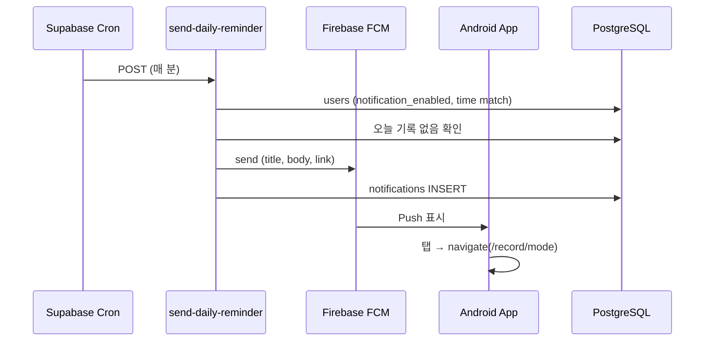
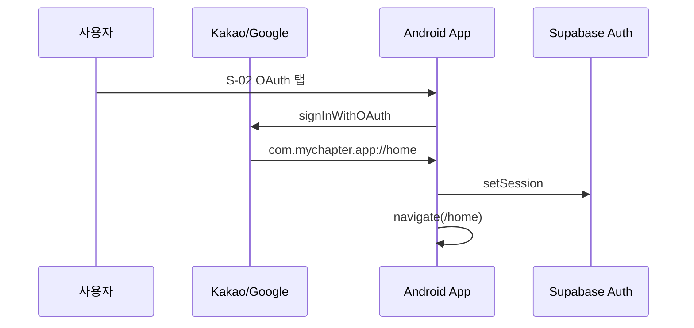

# MyChapter — 플랫폼·인프라 명세서 (Phase 6: Android·푸시·배포)

> **기준 문서:** 화면설계서 v1.1, 착수 프롬프트 v2.0  
> **대응 구현:** `android/`, `capacitor.config.ts`, `src/lib/push.ts`, `src/hooks/useNativeBridge.ts`, `supabase/functions/send-daily-reminder/`  
> **작성일:** 2026-06-12  
> **범위:** Capacitor Android, FCM, 딥링크, OAuth 네이티브 콜백, Vercel·Play 배포

> Phase 6는 **전용 화면 ID가 없음**. 아래 **P6-xx 모듈** 단위로 명세합니다.  
> 연관 화면: S-04(온보딩 알림), S-11(알림 목록), S-12(푸시 딥링크 목적지), S-24(알림 설정)

---

## Phase 6 모듈 목록

| ID | 모듈명 | 구현 위치 | 상태 |
|----|--------|-----------|------|
| P6-01 | Capacitor Android 프로젝트 | `android/`, `capacitor.config.ts` | ✅ |
| P6-02 | Native Bridge | `NativeBridge.tsx`, `useNativeBridge.ts` | ✅ |
| P6-03 | 딥링크 라우팅 | `deeplink.ts` | ✅ |
| P6-04 | OAuth 네이티브 콜백 | `authCallback.ts`, `LoginPage.tsx` | ✅ |
| P6-05 | FCM 클라이언트 | `push.ts`, `deviceTokens.ts` | ✅ *(Firebase 연동 🔄)* |
| P6-06 | 일일 알림 Cron | `send-daily-reminder`, `_shared/fcm.ts` | ✅ *(배포·Cron 🔄)* |
| P6-07 | Vercel 웹 배포 | `vercel.json`, `dist/` | ✅ *(배포 🔄)* |
| P6-08 | Play Store 준비 | `store/play-store-listing.ko.txt` | ✅ *(업로드 🔄)* |

**npm 스크립트:**

| 명령 | 동작 |
|------|------|
| `npm run cap:sync` | `build` + `npx cap sync` |
| `npm run cap:android` | Android Studio 열기 |
| `npm run cap:run:android` | sync 후 에뮬레이터/기기 실행 |

---

## P6-01 / Capacitor Android

### 앱 식별자

| 항목 | 값 |
|------|-----|
| `appId` | `com.mychapter.app` |
| `appName` | MyChapter |
| `webDir` | `dist` |
| `versionName` | `1.0` *(build.gradle)* |
| `versionCode` | `1` |
| `minSdk` | 23 |
| `targetSdk` / `compileSdk` | 35 |

### Capacitor 설정 (`capacitor.config.ts`)

| 옵션 | 값 |
|------|-----|
| `server.androidScheme` | `https` |
| Push `presentationOptions` | badge, sound, alert |

### AndroidManifest 권한

| 권한 | 용도 |
|------|------|
| `INTERNET` | Supabase·Edge API |
| `POST_NOTIFICATIONS` | Android 13+ 푸시 |
| `CAMERA` | 사진 기록 *(현재 HTML file input)* |
| `READ_MEDIA_IMAGES` | 갤러리 접근 |
| `VIBRATE` | 푸시 진동 |

### Intent Filter (딥링크)

| 스킴 / 호스트 | 용도 |
|---------------|------|
| `com.mychapter.app://` | OAuth redirect, 앱 커스텀 스킴 |
| `https://mychapter.app` | App Links (`autoVerify=true`) |

### MainActivity

- `BridgeActivity` 상속 — **커스텀 네이티브 코드 없음**
- `launchMode`: `singleTask` (딥링크 재진입)

### google-services.json

- `android/app/google-services.json.example` — 템플릿만 제공
- `build.gradle`: 파일 존재 시 `com.google.gms.google-services` 플러그인 적용
- **없으면:** 빌드는 되나 FCM 등록 불가 (로그: *Push Notifications won't work*)

### Capacitor 플러그인 (package.json)

| 플러그인 | Phase 6 사용 |
|----------|--------------|
| `@capacitor/app` | 딥링크 `appUrlOpen`, `getLaunchUrl` |
| `@capacitor/push-notifications` | FCM 등록·수신 |
| `@capacitor/camera` | 설치됨, **미사용** (HTML input) |
| `@capacitor/share` | 설치됨, Phase 6 범위 외 |

### Free / Pro 제한 분기

- **없음** — Android 패키징은 플랜 무관

### 설계(v1.1) 대비

| 설계 | 현재 |
|------|------|
| `MyChapterBilling` Android 플러그인 | ❌ 미구현 (JS bridge 스텁만) |
| FCM notification channel `daily_reminder` | Edge FCM payload에 지정, **Android 네이티브 채널 생성 코드 없음** |
| App Links `assetlinks.json` | 🔄 Vercel/도메인 설정 필요 |

---

## P6-02 / Native Bridge

### 구성

```
RootLayout
  ├── NativeBridge (렌더 null)
  │     └── useNativeBridge()
  ├── Outlet (라우트)
  └── PaywallModal
```

### 상태값

| Hook / Store | 필드 |
|--------------|------|
| `useAuthStore` | `user`, `profile` |
| `useNavigate` | React Router navigate |
| `Capacitor.isNativePlatform()` | 웹에서는 no-op |

### 동작 (네이티브 전용)

| Effect | 트리거 | 동작 |
|--------|--------|------|
| 딥링크 | mount | `App.addListener('appUrlOpen')` + `getLaunchUrl()` |
| FCM | `user` + `profile.notification_enabled` | `initPushNotifications` |
| FCM 해제 | user 없음 또는 알림 OFF | `resetPushState()` |

### 웹 vs 네이티브

| 기능 | 웹 | Android 앱 |
|------|-----|------------|
| NativeBridge | early return | 전체 동작 |
| Push | ❌ | ✅ (권한·토큰) |
| OAuth redirect | `{origin}/home` | `com.mychapter.app://home` |
| Play Billing | dev 모드만 | bridge 필요 |

---

## P6-03 / 딥링크 라우팅

### `resolveDeepLinkPath(url)`

| URL 패턴 | 변환 경로 |
|----------|-----------|
| `com.mychapter.app://home` | `/home` |
| `com.mychapter.app://record/mode` | `/record/mode` |
| `mychapter.app/records/abc` | `/records/abc` |
| `www.mychapter.app/...` | pathname 그대로 |
| 기타 | `null` (무시) |

**지원 호스트:** `mychapter.app`, `www.mychapter.app`  
**지원 프로토콜:** `mychapter:`, `com.mychapter.app:`

### 사용자 시나리오 → 결과

| 진입 | 처리 순서 | 목적지 |
|------|-----------|--------|
| 푸시 탭 | `pushNotificationActionPerformed` → `data.link` | `/record/mode` (기본) |
| App Link | `appUrlOpen` → `resolveDeepLinkPath` | 해당 pathname |
| OAuth redirect | `handleAuthCallback` **우선** | `/home` |

### API / Edge Function

- **없음** — 클라이언트 URL 파싱만

### 에러 케이스

| 상황 | 동작 |
|------|------|
| 잘못된 URL | `null`, navigate 없음 |
| `link` 없는 푸시 | 앱만 열림, 라우팅 없음 |

---

## P6-04 / OAuth 네이티브 콜백

### `handleAuthCallback(url)`

| URL 형태 | 처리 |
|----------|------|
| `#access_token=...&refresh_token=...` | `supabase.auth.setSession` |
| `?code=...` | `supabase.auth.exchangeCodeForSession` |
| 토큰/code 없음 | `false` |

### LoginPage OAuth redirect

```typescript
// Native
redirectTo: 'com.mychapter.app://home'

// Web
redirectTo: `${window.location.origin}/home`
```

### 플로우

```
1. S-02 OAuth 버튼
2. Supabase Auth → Kakao/Google
3. Redirect → com.mychapter.app://home#access_token=...
4. appUrlOpen / getLaunchUrl
5. handleAuthCallback → 성공
6. navigate('/home', { replace: true })
```

### Supabase 설정 (본인 작업 🔄)

Redirect URL 등록:

- `https://<supabase-project>.supabase.co/auth/v1/callback`
- `com.mychapter.app://home`
- `https://mychapter.app/home` *(웹)*

### 에러 케이스

| 상황 | 동작 |
|------|------|
| setSession 실패 | `false` → 일반 딥링크 처리 시도 |
| Redirect URL 미등록 | OAuth 실패 (Supabase 에러) |

---

## P6-05 / FCM 클라이언트

### `initPushNotifications(userId, onNavigate)`

**전제:** `Capacitor.isNativePlatform()` && `initialized === false`

| 단계 | 동작 |
|------|------|
| 1 | `PushNotifications.checkPermissions()` |
| 2 | `prompt` → `requestPermissions()` |
| 3 | `granted` 아니면 **종료** |
| 4 | `registration` listener → `upsertDeviceToken` |
| 5 | `pushNotificationActionPerformed` → `data.link` navigate |
| 6 | `PushNotifications.register()` |
| 7 | `initialized = true` |

### device_tokens API

| 함수 | 설명 |
|------|------|
| `upsertDeviceToken(userId, fcmToken, platform?)` | `(user_id, fcm_token)` UNIQUE upsert |
| `removeDeviceToken(userId, fcmToken)` | DELETE *(호출처 없음 — 갭)* |

**DB 스키마:**

```sql
device_tokens (user_id, fcm_token, platform, updated_at)
UNIQUE (user_id, fcm_token)
RLS: auth.uid() = user_id
```

### initPush 트리거 조건 (`useNativeBridge`)

| 조건 | Push |
|------|------|
| `user` 있음 + `notification_enabled=true` | init |
| user 없음 또는 알림 OFF | `resetPushState()` |

**주의:** S-04/S-24에서 DB `notification_enabled`만 변경 — **네이티브 OS 권한은 initPush 시점에 별도 요청**

### 연관 화면

| 화면 | 역할 |
|------|------|
| S-04 | 온보딩 시 `notification_enabled` 설정 *(OS 권한 X)* |
| S-24 | 기록 알림 ON/OFF → init/reset 연동 |
| S-11 | `daily_question` 알림 in-app 목록 |
| S-12 | 푸시 `link=/record/mode` 목적지 |

### Free / Pro 제한 분기

- **없음** — 알림은 Free/Pro 동일

### 에러 케이스

| 상황 | 동작 |
|------|------|
| 권한 거부 | init 중단, 토큰 미저장 |
| `registrationError` | `console.error` |
| `google-services.json` 없음 | register 실패 가능 |
| upsert 실패 | throw (uncaught) |

### 설계(v1.1) 대비

| 설계 | 현재 |
|------|------|
| 로그아웃 시 토큰 삭제 | ❌ `removeDeviceToken` 미호출 |
| S-24 ON 시 OS 권한 재요청 | ⚠️ user effect 재실행 시 init *(initialized 플래그로 1회만)* |
| iOS | ❌ Android만 |

---

## P6-06 / 일일 알림 Cron (`send-daily-reminder`)

### 호출

| 항목 | 값 |
|------|-----|
| Method | POST |
| URL | `/functions/v1/send-daily-reminder` |
| Auth | `Authorization: Bearer <CRON_SECRET>` |
| Cron | `*/1 * * * *` *(매 분, KST 시간 매칭)* |

*(설정: `005_cron_daily_reminder.sql` 주석, Supabase Dashboard Cron)*

### Edge Secrets

| Secret | 용도 |
|--------|------|
| `CRON_SECRET` | Cron 인증 |
| `FIREBASE_SERVICE_ACCOUNT_JSON` | FCM OAuth |
| `FIREBASE_PROJECT_ID` | FCM API URL |
| `SUPABASE_SERVICE_ROLE_KEY` | admin 클라이언트 |

### 처리 로직

```
1. KST 현재 시각 HH:mm → currentTime
2. users WHERE notification_enabled = true
3. notification_time (분 단위) == currentTime 필터
4. 각 user:
   a. 미완료 프로젝트 1개 (최신)
   b. 없으면 skipped++
   c. 오늘(KST) 해당 프로젝트 record 있으면 skipped++
   d. device_tokens 조회
   e. FCM 발송 (Firebase 설정 + 토큰 있을 때)
   f. notifications INSERT (type: daily_question, link: /record/mode)
5. Response: { target_users, push_sent, skipped, checked_at }
```

### FCM 메시지 (`_shared/fcm.ts`)

| 필드 | 값 |
|------|-----|
| title | 오늘의 질문이 도착했어요 ✍️ |
| body | 잠깐, 오늘 하루를 기록해볼까요? |
| data.link | `/record/mode` |
| android.channelId | `daily_reminder` |
| priority | HIGH |

### Firebase 미설정 시

- FCM 발송 **스킵** (`push_sent=0`)
- `notifications` INSERT는 **여전히 수행** → S-11 in-app 알림은 동작

### Free / Pro 제한 분기

- **없음**

### 에러 케이스

| 상황 | HTTP |
|------|------|
| CRON_SECRET 불일치 | 401 |
| DB/FCM 오류 | 500 |

### 설계(v1.1) 대비

| 설계 | 현재 |
|------|------|
| 사용자별 `notification_time` 정확 발송 | ✅ 분 단위 매칭 |
| 21:00 일괄 Cron | ⚠️ 매 분 스캔 방식 (부하↑, 정확도↑) |
| delete-account Play 구독 취소 | ❌ Edge 미구현 |

---

## P6-07 / Vercel 웹 배포

### `vercel.json`

| 설정 | 내용 |
|------|------|
| SPA rewrite | `/((?!assets/|legal/|vite.svg).*)` → `/index.html` |
| Headers | `X-Content-Type-Options: nosniff`, `X-Frame-Options: DENY` |

### 빌드 산출물

| 경로 | 설명 |
|------|------|
| `dist/index.html` | SPA 엔트리 |
| `dist/assets/*` | JS/CSS 번들 |
| `public/legal/*.html` | S-W2/W3 정적 페이지 |

### 환경 변수 (Vercel)

```
VITE_SUPABASE_URL
VITE_SUPABASE_ANON_KEY
VITE_PRIVACY_POLICY_URL
VITE_TERMS_URL
VITE_BILLING_DEV_MODE=false   # prod
VITE_APP_URL=https://mychapter.app
```

### 배포 확인 체크리스트

| URL | 기대 |
|-----|------|
| `/` | → `/splash` redirect |
| `/legal/privacy.html` | 개인정보처리방침 |
| `/legal/terms.html` | 이용약관 |
| `/home` | 로그인 후 SPA |

### App Links 연동 (Android)

- `https://mychapter.app/.well-known/assetlinks.json` 필요
- Vercel 또는 도메인에 JSON 호스팅 🔄

### Free / Pro 제한 분기

- 웹 prod: Paywall → 「모바일 앱에서 결제해주세요」

---

## P6-08 / Play Store 준비

### 스토어 설명 초안

- `store/play-store-listing.ko.txt`
- 앱명, 짧은/전체 설명, 주요 기능, 법적 URL

### Play Console 체크리스트 (본인 🔄)

| 항목 | 값/작업 |
|------|---------|
| 패키지명 | `com.mychapter.app` |
| 구독 Product ID | `mychapter_pro_monthly` |
| 가격 | 월 5,900원 |
| 개인정보처리방침 URL | `https://mychapter.app/legal/privacy.html` |
| AAB 업로드 | Android Studio → Generate Signed Bundle |
| keystore | **백업 필수** |

### Android 빌드 플로우

```
npm run cap:sync
npm run cap:android          # Android Studio
Build → Generate Signed Bundle/APK
Play Console → 내부 테스트 트랙 업로드
```

### Play Billing 연동 (Phase 5 연계)

| 레이어 | 상태 |
|--------|------|
| JS `purchasePro()` | dev 토큰 / `MyChapterBilling` bridge |
| Edge `verify-subscription` | Google Play API 검증 코드 ✅ |
| Android Billing Library | ❌ 네이티브 플러그인 미구현 |

---

## Phase 6 End-to-End 플로우

### 푸시 알림 (일일 기록 리마인더)



### OAuth + 딥링크 (앱 로그인)



---

## Phase 6 환경 변수·Secrets 요약

| 변수 | 위치 | Phase 6 용도 |
|------|------|--------------|
| `google-services.json` | `android/app/` | FCM 클라이언트 |
| `FIREBASE_SERVICE_ACCOUNT_JSON` | Supabase Secret | Edge FCM 발송 |
| `FIREBASE_PROJECT_ID` | Supabase Secret | FCM API |
| `CRON_SECRET` | Supabase Secret | Cron 인증 |
| `GOOGLE_PLAY_SERVICE_ACCOUNT_JSON` | Supabase Secret | verify-subscription |
| `VITE_APP_URL` | Vercel / .env | App Links, OAuth |

---

## Phase 6 구현 갭 (v1.1 대비)

| # | 항목 | 설계 | 현재 |
|---|------|------|------|
| 1 | `MyChapterBilling` Android | Play Billing Library | ❌ JS bridge 스텁만 |
| 2 | FCM notification channel | Android `daily_reminder` 채널 생성 | ❌ Edge payload만 |
| 3 | 로그아웃 FCM 토큰 삭제 | `removeDeviceToken` | ❌ 미호출 |
| 4 | Push re-init (알림 ON) | S-24 토글 후 재등록 | ⚠️ `initialized` 1회 제한 |
| 5 | S-04 OS 알림 권한 | 온보딩에서 권한 요청 | ❌ DB 플래그만 |
| 6 | App Links 검증 | `assetlinks.json` | 🔄 도메인 설정 필요 |
| 7 | iOS Capacitor | 추후 | ❌ Android만 |
| 8 | `@capacitor/camera` | 네이티브 카메라 | ❌ HTML file input |
| 9 | delete-account Play 해지 | Edge에서 구독 취소 | ❌ |
| 10 | FCM E2E | 실기기 푸시 수신 | 🔄 Firebase 설정 후 |

---

## Phase 6 파일·디렉터리 요약

```
android/
├── app/src/main/AndroidManifest.xml   # 권한·intent-filter
├── app/build.gradle                   # google-services 조건부
├── app/google-services.json.example
└── app/.../MainActivity.java          # BridgeActivity

capacitor.config.ts
vercel.json
store/play-store-listing.ko.txt

src/
├── hooks/useNativeBridge.ts
├── components/layout/NativeBridge.tsx
├── lib/push.ts
├── lib/deeplink.ts
├── lib/authCallback.ts
└── lib/api/deviceTokens.ts

supabase/
├── functions/send-daily-reminder/
├── functions/_shared/fcm.ts
└── migrations/005_cron_daily_reminder.sql
```

---

## 관련 문서

- `docs/06-user-tasks.md` — Firebase, Vercel, Play Console 본인 작업
- `docs/09-supabase-setup.md` — Cron·Secrets 설정
- `docs/03-edge-functions-api.md` — §9 send-daily-reminder
- `docs/13-screen-spec-phase5-mypage-payment.md` — S-24 알림 설정, Billing
- `docs/10-screen-spec-phase3-home-record.md` — S-11, S-12
- `docs/07-dev-progress.md` — Phase 6 현황
